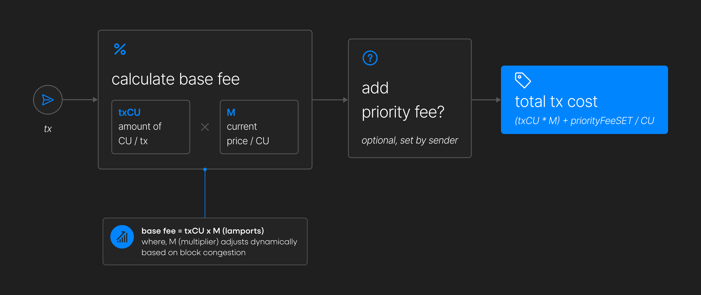

# Dynamic Base Fees

**Base fees that adjust to actual network demand**

Transaction pricing on the X1 Blockchain consists of **base fees** and **priority fees**:

- **Base fees** dynamically adjust based on network congestion.
- **Priority fees** are optional user-set tips to validators, helping prioritize transactions in local fee market threads.

## Solana’s Transaction Fee Model

Solana prioritizes transactions through **local fee markets**, but its static **5,000 lamport** base fee per transaction signature is insufficient during periods of high demand. This leads to several issues:

- **Spam vulnerability** – Fixed fees fail to deter excessive low-value transactions.
- **Lack of global adjustment** – No system-wide Compute Unit (CU) accounting leads to congestion.
- **Performance bottlenecks** – Without dynamic pricing, low-priority transactions compete for resources, reducing efficiency.

## X1’s Fee Model: Congestion-Reflective Dynamic Base Fees

X1 dynamically adjusts base fees based on **global compute-unit (CU) congestion** across its threads. The network enforces a **48M CU per block limit**, with fees scaling based on resource consumption:

- **Higher CU usage → Higher fees**
- **Increased network load → Progressive fee scaling**

This **economic backpressure** ensures:

- ✅ **Reduced spam** – Costly low-value transactions are discouraged.
- ✅ **Optimal resource allocation** – Transactions reflect actual demand.
- ✅ **Sustained performance** – High-priority transactions maintain efficiency.

.png>)

## Fee Model Comparison

| Blockchain   | Execution Model | Base Fee Strategy                           | Spam Mitigation |
| ------------ | --------------- | ------------------------------------------- | --------------- |
| **Ethereum** | Single-threaded | Global base fees, high costs                | Limited         |
| **Solana**   | Multi-threaded  | Local fee markets, static fees              | Low deterrence  |
| **X1**       | Multi-threaded  | Dynamic base fees, congestion-based pricing | High deterrence |

X1 combines **parallel execution** (like Solana) with **global base fee enforcement** (like Ethereum). However, unlike Solana’s static base fees, **X1 scales fees dynamically**, ensuring fair transaction pricing based on computational demand.

## The Impact of X1’s Pricing Model

The **dynamic base fee system** ensures **low transaction costs**, increasing only as network usage rises. This has several benefits:

- ✅ **Higher validator earnings** – As network activity grows, validator rewards increase.
- ✅ **Deflationary effect** – More transactions lead to higher native coin burns, increasing blockchain value.
- ✅ **Efficient & cost-effective transactions** – Spam is minimized, and fees align with demand.

By linking fees to actual computational load, X1 maintains **high performance, scalability, and decentralization**.

## Technical Implementation

---

X1’s **dynamic base fees** optimize transaction costs while maintaining **network integrity and efficiency**, making it a robust alternative to traditional static fee models.
