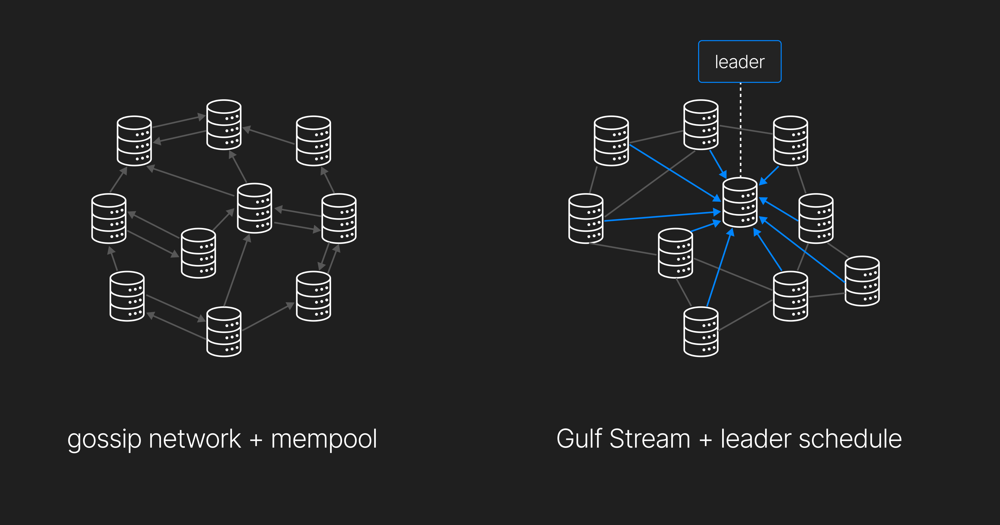
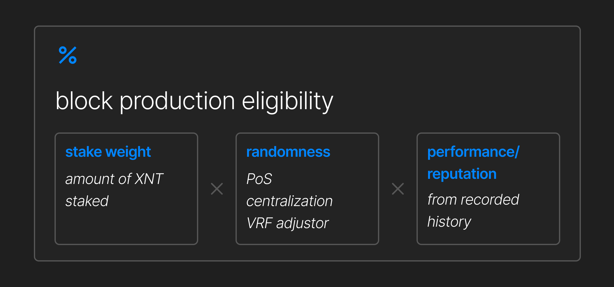

# Stake, Performance, and Randomness-Based Leader Selection

## The Role of the Leader

Solana was designed to operate **without a mempool**, setting it apart from many traditional blockchains. Instead of relying on gossip protocols to propagate transactions randomly across the network, Solana forwards all transactions to a predetermined lead validator—known as the **leader**—for each slot.

When an RPC receives a transaction message, it must forward it to the designated leader responsible for block production.

## Leader Selection

Before every **epoch** (approximately **every two days**), a **leader schedule** is generated. Each epoch is divided into **slots**, each lasting **400 milliseconds**, with a leader assigned to each slot.

Leaders are determined **in advance**, allowing validators to know when their turn will come. Leader rotation happens rapidly, with a new leader every few hundred milliseconds.

🔹 **Higher stake = higher probability of selection.** Validators with a greater stake have an increased chance of being chosen as leaders within an epoch.

During their slot, the selected leader switches into **"leader mode,"** actively processing transactions and broadcasting blocks to the network.

## Validator Performance and Its Impact

Solana’s **skip rate**—the percentage of slots in which a block was not produced—varies between **2% and 10%**. While forks contribute to this issue, **validator performance** is a significant factor.

🚨 **Current Issue:** The only criterion for leader selection today is **stake weight**, without consideration for validator performance.

If a validator with poor network connectivity or inadequate hardware is chosen as a leader, they risk **skipping slots** and slowing down the network. This can lead to dropped transactions, reducing the chain’s overall efficiency.

💡 Some validators, despite having **high stake weight**, frequently skip slots—sometimes **over 50%**—yet continue being selected in the leader schedule. Solana **does not** currently remove underperforming validators, causing inefficiencies in block production.

## X1’s Solution: Performance-Based Leader Selection

To improve efficiency, **leader selection must go beyond just stake weight**. X1 Blockchain introduces a **performance-based selection mechanism** to ensure **only high-functioning validators** are chosen.

🔹 **How It Works:**

- A validator’s **stake weight is converted into a performance-adjusted score**.
- Validators with **poor historical performance** will see **their score reduced**.
- If performance falls too low, a validator will be **removed from the leader schedule**.

### **Why This Matters:**

✅ **Encourages high-performance nodes** – Validators have an economic incentive to optimize their infrastructure.  
✅ **Prevents network slowdowns** – Poor performers are filtered out.  
✅ **Ensures reliable block production** – Leaders are chosen based on both **stake and track record**.

## Combating PoS Centralization with Randomness

Proof-of-Stake (PoS) systems often risk centralization since wealthier validators have a **higher probability of selection**.

🔹 **To mitigate this, X1 will integrate randomness into leader selection** using a **Verifiable Random Function (VRF)**.

📌 **How It Works:**

- **Solana’s predictable leader schedule is maintained**, ensuring efficiency.
- However, **VRF will be introduced through the Anti-Collusion Protocol (ACP)** to add an element of randomness.
- Unlike Solana, X1’s selection process will be based on **the entire validator set**, **not just stake weight**.

**🌍 The result?** A **fairer, more decentralized** leader selection process that prevents large validators from dominating the network.

## Conclusion

X1 Blockchain’s leader selection is **multi-factorial**, incorporating:  
✔ **Stake Weight** – Validators with more stake still have an advantage.  
✔ **Performance Metrics** – Poor-performing validators are penalized or removed.  
✔ **Randomness via VRF** – Reduces the risk of centralization.

By balancing **performance, fairness, and decentralization**, X1 ensures a **more efficient and equitable** blockchain network. 🚀
