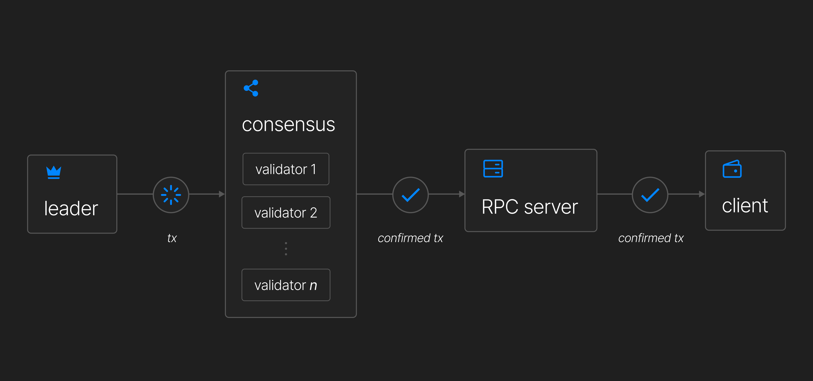

# Scaling Through Reductionism

## Consensus Mechanism

In X1 Blockchain, transactions progress through multiple stages:

1. **Execution** – The leader executes the transaction and records it in its ledger.
2. **Propagation** – The transaction is shared across the network.
3. **Confirmation** – A block is confirmed once it gathers enough votes.
4. **Finalization** – A block is finalized after 31+ confirmed blocks are built on top of it.

These status updates are returned via RPC, allowing users to track their transactions in real time.

### Continuous vs. Discrete Block Building

Most blockchains construct entire blocks before broadcasting them (**discrete block building**).  
Solana, however, uses **continuous block building**, streaming blocks dynamically in real time.  
This reduces latency and speeds up transaction finalization.

To achieve consensus:

- ✅ The **leader** breaks the block into **shreds** (smaller data pieces).
- ✅ Validators reconstruct the block by verifying **Proof of History (PoH) hashes** and transaction validity.
- ✅ Validators vote on valid blocks.
- ✅ Once a **supermajority (66.6%)** of validators confirm a block, it is **finalized** and added to the chain.

This system works efficiently when the network is small but faces **scalability challenges** as it grows.

## Algorithmic Complexity

%20(1).png>)

### The Blockchain Scalability Challenge

Scalability, security, and decentralization must be balanced.  
Traditional blockchains (e.g., Bitcoin, Ethereum) struggle with congestion, leading to:

- **High fees** due to transaction competition.
- **Slow confirmations** during peak demand.

Bitcoin and Ethereum use **Nakamoto-style consensus**, which requires high fees to prioritize transactions.

### The Quadratic Complexity Problem

Some blockchains, like **Solana and Fantom**, use asynchronous block voting.  
This speeds up transactions but increases consensus complexity to **O(n²)**—  
meaning network efficiency declines as more nodes join.

### How Avalanche Solves It

Avalanche introduces **neighborhoods**, using a gossip-based structure to reduce complexity to **O(log(n))**.  
This keeps transaction speeds high without compromising scalability.

## X1 Blockchain: Scaling Through Reductionism

X1 Blockchain enhances consensus efficiency by **introducing subcommittee voting**, inspired by **HotStuff2**.

### Why This Matters

Traditional blockchains require all nodes to vote, creating an **O(n²) bottleneck**.  
X1 instead selects **subcommittees** to handle voting, reducing communication overhead.

### The Key Advantage

- Instead of every node participating, only a **subset (x) of nodes** vote.
- This enables **constant-time consensus: O(1)**.
- The network supports **unlimited validators** while keeping consensus **fast and scalable**.

By reducing complexity without sacrificing security, X1 achieves **high performance, lower latency, and better scalability**.

.png>)
