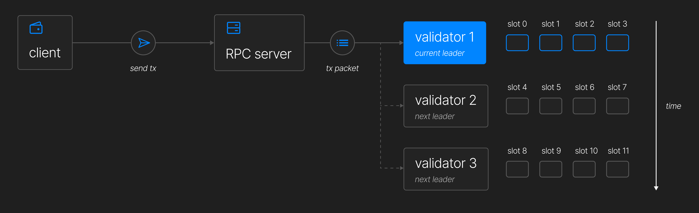
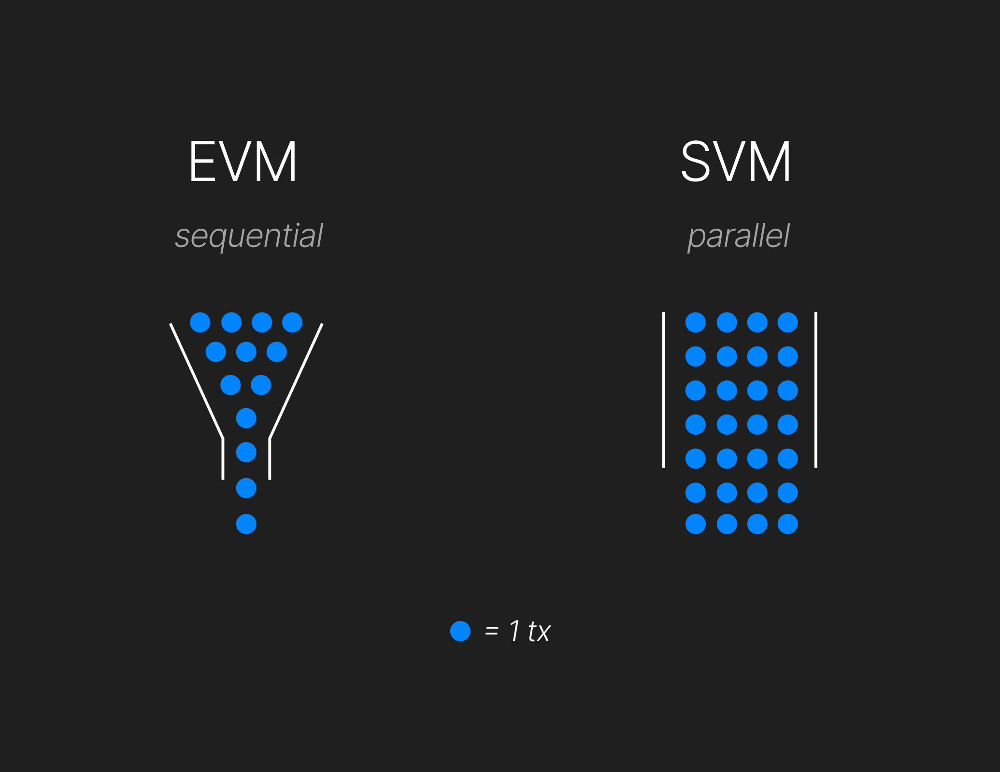
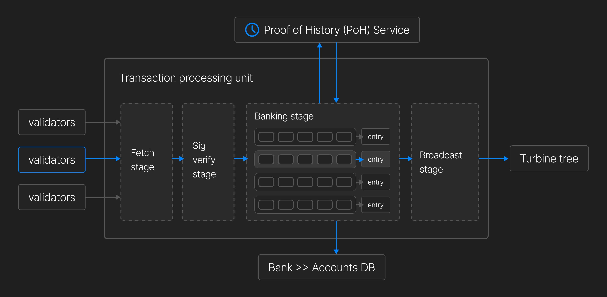
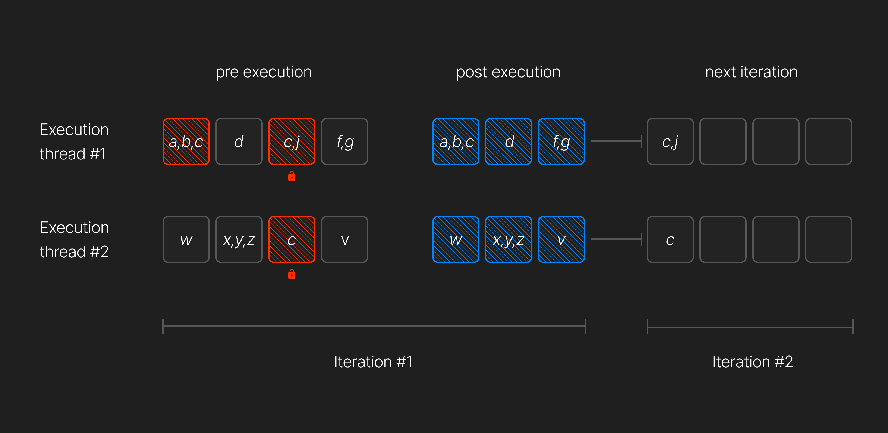
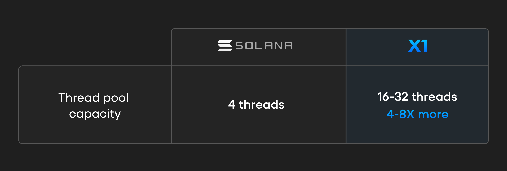

# SVM Capacity Scaling

## Scheduling

### Initiating the Transaction

Once a user signs a transaction in their wallet, the wallet sends it to an X1 RPC server. RPC servers can be run by any validator. Upon receiving the transaction, the RPC server checks the leader schedule (determined once per epoch, about two days long) and forwards the transaction to the current leader as well as the next two leaders. The leader is responsible for producing a block for the current slot and is assigned four consecutive slots. Slots usually last around 400 milliseconds.

Once the signed transaction reaches the current leader, it validates the transaction's signature and performs pre-processing before scheduling the transaction for execution.

### Multi-Thread Parallelization

Unlike the **EVM**, which is a single-threaded runtime that processes only one contract at a time, the **SVM** is multi-threaded, allowing it to process more transactions in significantly less time. Each thread contains a queue of transactions waiting to be executed, with transactions randomly assigned to a queue.

The default scheduler implementation is multi-threaded, with each thread maintaining its own transaction queue. Transactions are randomly assigned to a queue and ordered by **priority fee** (fee paid per compute unit requested) and **time**.

Notably, there is no global ordering of transactions queued for execution—only local ordering within each thread’s queue.

---

## Block Building & Banking Stage

Most blockchain networks construct full blocks before broadcasting them, a process known as **discrete block building**. In contrast, **X1 and Solana employ continuous block building**, dynamically assembling and streaming blocks as they are created. This approach significantly reduces latency.

Each slot lasts **400 milliseconds**, and each leader is assigned **four consecutive slots (1.6 seconds)** before the role rotates. For a block to be accepted, all transactions within it must be valid and reproducible by other nodes.

Two slots before assuming leadership, a validator halts transaction forwarding to prepare for the upcoming workload. During this time, **inbound traffic spikes** to over **one gigabyte per second**, as the entire network directs packets to the next leader.

### Transaction Processing Stages

1. **Fetch Stage** – Transactions are received via **QUIC**.
2. **SigVerify Stage** – Signatures are validated, and duplicate transactions are removed.
3. **Banking Stage** – Transactions are processed in parallel and grouped into **ledger entries** (batches of 64 non-conflicting transactions).

Parallel transaction processing is possible because each transaction **explicitly lists all accounts it will read and write to**. This design choice shifts complexity onto developers but enables the validator to avoid race conditions by only selecting non-conflicting transactions for execution in each entry.

In the diagram above:

- **Thread 1** locks `[a, b, c]` and `[d]` but fails to lock `[c, j]` and `[f, g]`.
- **Thread 2** locks `[w]` and `[x, y, z]` but fails to lock `[c]` and `[v]`.

**Non-conflicting transactions run in parallel, improving efficiency**, while conflicting transactions must be executed sequentially.

The system uses **six threads for transaction processing**:

- **Four threads handle normal transactions**
- **Two threads handle vote transactions**, which are essential to X1 and Solana’s consensus mechanisms

Once transactions are executed, their changes are finalized and stored in the blockchain state.

---

## Current Limitations in SVM Architecture

Solana’s **high throughput** is largely due to its parallel processing architecture. However, a major limitation is the **fixed number of banking threads** used for transaction execution.

### Key Issues:

- **Underutilization of Multi-Core Processors** – Modern processors often have **16, 32, or more cores**, but Solana limits banking threads to just **four**, wasting computational resources.
- **Execution Bottlenecks** – This artificial cap restricts transaction processing, leading to **higher latency and lower throughput** during peak network activity.
- **Limited Parallelism** – The effectiveness of Solana’s parallel processing is reduced due to this limitation, preventing full optimization.

---

## X1 Blockchain’s Solution: Dynamic Thread Scaling

To address these inefficiencies, X1 Blockchain introduces **dynamic thread scaling**, which allows the number of banking threads to scale based on the CPU core count of the node.

### Key Improvements:

✔ **Adaptive Thread Allocation** – Banking threads are dynamically assigned based on available CPU cores. For example, a **32-core processor** can have up to **32 banking threads**, maximizing efficiency.

✔ **Increased Parallelism** – More threads allow for **greater transaction throughput**, minimizing bottlenecks.

✔ **Higher Throughput** – More transactions can be processed concurrently, reducing confirmation times, especially during peak network usage.

✔ **Future-Proof Scalability** – As hardware advances, X1’s execution scheduler will **automatically scale**, ensuring long-term performance and efficiency.

By eliminating **artificial constraints** on banking threads, X1 Blockchain ensures that **modern hardware is fully utilized**, making the network faster, more efficient, and scalable for future growth.
