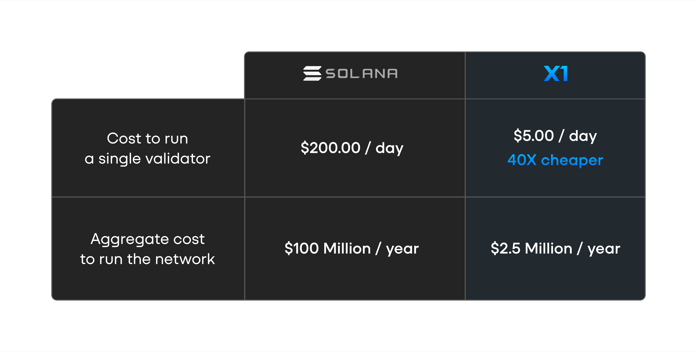

# Zero-Cost Votes

**Lowering the barrier to validate the X1 blockchain**

## The Problem: High Vote Costs on Solana

Solana’s vote costs create significant challenges for decentralization. At a SOL price of $250, validators must pay approximately **$8,600 per month** to participate in consensus, with **94% of this cost coming from voting fees**. This high barrier to entry discourages smaller validators and disproportionately benefits larger ones. While validators bear these costs to support the network, top leaders profit from vote fees and block rewards, further centralizing control.

### Flaws in the Justifications for Vote Fees

Proponents argue that vote fees:

- Cover compute resources (**2,100 CUs per vote**)
- Deter spam attacks

However, these justifications are flawed:

- **Votes Strengthen the Network**  
  Votes enhance security and resilience. Taxing them discourages participation, ultimately weakening the system.

- **Spam Is Not a Concern**  
  Weighted votes require stake to count, making spam voting ineffective. Malicious actors could already spam at low cost, and a true consensus attack would still require **33% of the total stake**, an unattainable threshold.

## The Solution: Zero-Cost Voting on X1

On the [X1 testnet (Xolana)](https://x1val.online/), a large cluster of nodes has demonstrated that **removing vote costs is both possible and beneficial**. Eliminating these fees significantly reduces validator expenses, **improving scalability, profitability, and decentralization**.

- **Lower barriers to entry** → More validators join the network
- **Greater decentralization** → Reduced reliance on large validators
- **Fairer ecosystem** → Aligns with the principle that any cost above zero is a tax on participants

### Addressing Congestion Concerns

A common concern is whether full blocks could push out votes, as seen during [solXEN](https://solxen.io/) PoW on Solana. X1 mitigates this risk by implementing **congestion-reflective dynamic base fees**, ensuring that:

- Blocks are **never full**
- Votes **are not displaced**
- Even in rare delays, consensus is **only postponed by one block**, maintaining network security

## The Impact: A More Efficient and Inclusive Blockchain

By eliminating vote costs, X1:

- ✅ **Reduces validator expenses**
- ✅ **Improves network incentives**
- ✅ **Promotes decentralization**

This system is **nearing full implementation** and will be ready before X1’s launch.

### A 40× Increase in Cost Efficiency

Lower validator operational costs translate to a **40× increase in cost efficiency**, significantly reducing the aggregate cost to run the entire network.

---

X1’s zero-cost vote model is a fundamental shift, making blockchain validation **more accessible, efficient, and inclusive**.
